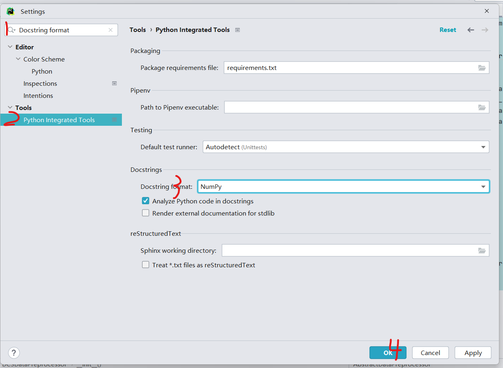

# Industrial Computation

## 项目结构
    .
    ├── README.md
    ├── config
    ├── ├── data_config
    ├── ├── ├── {...}_config.yaml
    ├── ├── model_config
    ├── ├── ├── {...}_config.yaml
    ├── ├── train_config
    ├── ├── ├── {...}_config.yaml
    ├── data
    ├── data_preprocessors
    ├── ├── __init__.py
    ├── ├── abs.py
    ├── ├── {...}DataPreprocessor.py
    ├── datasets
    ├── ├── __init__.py
    ├── ├── abs.py
    ├── ├── {...}DataSet.py
    ├── models
    ├── ├── __init__.py
    ├── ├── public
    ├── ├── ├── {...}Model
    ├── ├── ├── ├── __init__.py
    ├── ├── ├── ├── {...}_arch.py
    ├── trainers
    ├── ├── __init__.py
    ├── ├── abs.py
    ├── ├── {...}Trainer.py
    ├── utils
    ├── ├── early_stop.py
    ├── ├── metrics.py
    ├── ├── scaler.py
    ├── ├── time_decorator.py
    ├── jupyter_notebooks
    ├── results
    ├── model_states
    ├── main.py
    ├── requirements.txt


### config
config文件夹中包含了三个子文件夹，分别是data_config, model_config, train_config。

data_config中包含了数据预处理的配置文件，model_config中包含了模型的配置文件，train_config中包含了训练的配置文件。

将其分开的原因是为了方便在不同的数据集、模型、训练方式下进行组合，方便进行实验。

#### data_config
```yaml
data_preprocessor_name: {DataPreprocessorName}
data_preprocessor_params: {}
scaler_name: {ScalerName}
scaler_params: {}
dataset_name: {DatasetName}
dataset_params: {}
dataloader_params: {}
```
{}_name 参数指明了使用的类的名称，{}params 参数指明了类的参数，这些参数会被传递给类的__init__方法。

dataloader直接调用pytorch中的官方方法，请确认参数与官方文档一致。
#### model_config
```yaml
model_name: {ModelName}
model_params: {}
```
{}_name 参数指明了使用的模型的名称，{}params 参数指明了类的参数，这些参数会被传递给模型类的__init__方法。

#### train_config
```yaml
# basic
random_seed: int # 随机种子
batch_size: int # batch size
device: cuda:0 or cpu # 设备
load_checkpoint: bool # 是否加载checkpoint

optimizer_name: {pytorch optimizer name}
optimizer_params: {}
scheduler_name: {pytorch scheduler name}
scheduler_params: {}
trainer_name: {trainer name}
trainer_params: {}
```
random_seed，batch_size，device，load_checkpoint参数为基本参数。

{}_name 参数指明了使用的类的名称，{}params 参数指明了类的参数，这些参数会被传递给类的__init__方法。

optimizer和scheduler直接调用pytorch中的官方方法，请确认参数与官方文档一致。

### data_preprocessors
`data_preprocessors` 模块负责数据的预处理，包括数据的加载、预处理和分割。该模块中的每个数据预处理器都应继承自 `AbstractDataPreprocessor` 抽象基类，并实现其定义的抽象方法。

- **属性**:
  - `data_path` (str): 数据文件的路径。
  - `train_ratio` (float, 可选): 训练数据的比例，默认为 0.6。
  - `valid_ratio` (float, 可选): 验证数据的比例，默认为 0.2。
  - `update_dataset_params` (dict): 存储用于更新数据集参数的字典。
  - `update_model_params` (dict): 存储用于更新模型参数的字典。
  - `update_trainer_params` (dict): 存储用于更新训练器参数的字典。

- **应当实现的方法**:
  - `load_data()`: 用于加载数据。
  - `preprocess()`: 用于预处理数据。该方法应返回预处理后的数据数组。
  - `split_data(preprocessed_data)`: 用于将预处理后的数据分割为训练集、验证集和测试集。

- **使用指南**:
  - 相比于dataset，preprocessor应当处理缺失值填充、特征工程等任务。而dataset中只应实现分窗等简单的操作。 
  - 据预处理器会根据实现的逻辑依次执行数据加载、预处理和分割任务。数据加载将在preprocessor实例化时执行。 
  - 考虑到dataset、model和trainer的行为可能会与数据集的参数有关，或需要共享参数，因此针对需要共享的参数，请在preprocess方法中将参数添加到 `update_dataset_params`、`update_model_params` 和 `update_trainer_params` 字典中。 
  preprocessor会将将 `update_dataset_params`、`update_model_params` 和 `update_trainer_params` 字典，传递给dataset、model和trainer。

- **注意**:
    - 新实现的preprocessor应当在 `__init__.py` 文件中导入，并注册到 `__all__` 列表中。

### datasets
`datasets` 模块定义数据集的结构和访问方式。该模块中的每个数据集类都应继承自 `AbstractDataset` 抽象基类，并重写特定的方法以实现数据集的具体功能。

- **应当实现的方法**:
  - `__init__(data, **kwargs)`: 用于初始化，data_config中的dataset_params会和
  data_preprocessors中update_dataset_params中的参数合并后传递给该方法。
  - `__getitem__(index)`：用于从数据集中检索指定索引的数据项。
  - `__len__()`：用于获取数据集的总长度。与DataLoader兼容。

- **注意**:
  - 确保实现的dataset符合 PyTorch dataset的接口要求。
  - 新实现的dataset类应当在 `__init__.py` 文件中导入，并注册到 `__all__` 列表中。

### models
#### 模型初始化 (__init__方法)
在模型的`__init__`方法中，以下参数应统一使用命名关键字参数进行传递：
- **节点数 (`num_nodes`)**: 整型 (int)。指定图或数据中的节点数量。常见的别名包括 `data_dim`、`num_vars` 等。
- **历史长度 (`history_len`)**: 整型 (int)。定义历史数据的时间窗口大小。常见的别名包括 `in_len`、`history_window_size` 等。
- **预测长度 (`forecast_len`)**: 整型 (int)。定义预测的时间窗口大小。常见的别名包括 `out_len`、`future_window_size` 等。
- **通道数 (`channel`)**: 整型 (int)。指定数据的特征维度或通道数。常见的别名包括 `feature_dim`、`num_features` 等。

以上参数，以及其他与数据集相关的参数，应由 `DataPreprocessor` 类计算并添加到 `update_model_params` 字典中。`update_model_params` 字典中的参数将自动传递给 `model.__init__` 方法。

#### forward 方法
模型应实现 `forward` 方法，其定义如下：

```python
def forward(self, x: torch.Tensor, *args, **kwargs) -> torch.Tensor:
```
参数:
x (torch.Tensor): 输入数据，其形状应为 [batch_size, history_len, num_nodes, channel]。
*args: 允许模型接收额外的位置参数。
**kwargs: 允许模型接收额外的关键字参数。

返回:
torch.Tensor: 模型的输出。

输出形状应符合以下条件：
- 迭代多步预测模型：[batch_size, 1, num_nodes, channel]。
- 直接多步预测模型：[batch_size, forecast_len, num_nodes, channel]。
- 分类模型：待定。
- ... ...

注意:
- 请避免在模型内部实现迭代多步预测的逻辑。

- **注意**:
    - 新实现的模型应当在 `__init__.py` 文件中导入，并注册到 `__all__` 列表中。
  
### trainers
Trainer接受传入的模型、数据集、优化器、调度器等，在其内部完成训练、验证、测试等任务。
所有的Trainer都应继承自AbstractTrainer抽象基类，并实现其定义的抽象方法。
### Trainer

#### 概述
`Trainer` 类是用于训练机器学习模型的核心组件，专注于模型的训练、验证和测试。所有自定义训练器都应继承自 `AbstractTrainer` 抽象基类。

- **属性**:
  - **`model` (torch.nn.Module)**: 要训练的神经网络模型。
  - **`optimizer` (torch.optim.Optimizer)**: 用于训练模型的优化器。
  - **`scheduler` (torch.optim.lr_scheduler)**: 学习率调度器。
  - **`scaler` (Scaler)**: 数据标准化的工具。
  - **`model_save_path` (str)**: 保存训练模型和检查点的路径。
  - **`result_save_dir_path` (str)**: 保存训练结果和日志的目录路径。
  - **`max_epoch_num` (int)**: 模型训练的最大周期数。
  - **`enable_early_stop` (bool, 可选)**: 是否启用早停机制，默认为 `False`。
  - **`early_stop_patience` (int, 可选)**: 早停耐心值，即在停止之前等待改善的周期数，默认为 5。
  - **`early_stop_min_is_best` (bool, 可选)**: 判断性能好坏的标志，若为 `True`，则表示更低的值表示更好的性能，默认为 `True`。
- **包含的方法**:
  - **`train(train_data_loader, eval_data_loader, metrics)`**: 使用训练和评估数据加载器对模型进行训练。
  - **`test(test_data_loader, metrics)`**: 使用测试数据加载器对模型进行测试。
  - **`save_checkpoint(filename)`**: 保存当前的训练状态。
  - **`load_checkpoint(filename)`**: 从检查点加载训练状态。
- **应当实现的方法**:
  - **`loss_func(y_pred, y_true, *args, **kwargs)`**: 模型的损失函数。
    - 待补充
  - **`train_one_epoch(*args, **kwargs)`**: 一个训练周期的训练逻辑。
    - 待补充
  - **`evaluate(data_loader, metrics, *args, **kwargs)`**: 模型的评估逻辑。
    - 待补充

- **注意**:
    - 新实现的模型应当在 `__init__.py` 文件中导入，并注册到 `__all__` 列表中。


## 注释和格式化
推荐使用Numpy风格进行函数注释： 

https://numpydoc.readthedocs.io/en/latest/format.html

Pycharm中设置Numpy风格注释：



推荐使用Black进行代码格式化：
https://blog.csdn.net/winfred_hua/article/details/126163560

提交到Public的代码必须使用Black进行格式化，否则无法通过CI检查。

## Git
   todo